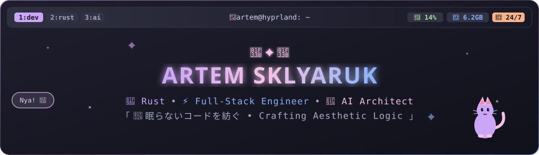

<!-- ⚠️ IMPORTANT: Rename this repository to match your exact GitHub username (e.g. username/username) for it to display as your Profile README -->

<!-- 🌸 HYPRLAND & CATPPUCCIN HEADER BANNER -->

<!-- ✨ ANIMATED CATPPUCCIN DIVIDER -->

<!-- 🎀 TYPING SVG INTRO -->
<h1 align="center">
  
</h1>

<!-- 🐈 VSCODE-PETS CLONE: ANIMATED CAT SANCTUARY -->

  

<!-- 💫 ANIMATED DIVIDER -->

<!-- 📸 PROFILE AVATAR & LIVE STATUS BADGES -->

  

  
  
  
  

<!-- ✨ ANIMATED DIVIDER -->

<!-- 🖥️ TERMINAL VIEW (SYSTEM SPECS & FASTFETCH) -->
<h3 align="left">
  
  <b>Hyprland Workstation Terminal</b>
</h3>

  

<!-- ✨ ANIMATED DIVIDER -->

<!-- 🗨️ DISCORD PRESENCE & LANYARD STATUS -->
<h3 align="left">
  
  <b>Live Discord Activity</b>
</h3>

  

<!-- ✨ ANIMATED DIVIDER -->

<!-- 🐍 GITHUB CONTRIBUTION SNAKE -->
<h3 align="left">
  
  <b>Contribution Grid Snake</b>
</h3>

  <picture>
    <source media="(prefers-color-scheme: dark)" srcset="https://raw.githubusercontent.com/fr1ndz/fr1ndz/output/github-contribution-grid-snake-dark.svg" />
    <source media="(prefers-color-scheme: light)" srcset="https://raw.githubusercontent.com/fr1ndz/fr1ndz/output/github-contribution-grid-snake.svg" />
    
  </picture>

<!-- ✨ ANIMATED DIVIDER -->

<!-- 📊 GITHUB STATS SECTION -->
<h3 align="left">
  
  <b>Code Statistics &amp; Analytics</b>
</h3>

<!-- Profile Details Card -->

  

<!-- Language & Commit Cards Grid -->

  
  

  
  

<!-- ✨ ANIMATED DIVIDER -->

<!-- 🛠️ TECH STACK SECTION -->
<h3 align="left">
  
  <b>Tech Arsenal &amp; Capabilities</b>
</h3>

  <!-- Languages -->
  
  
  
  
  
  
  

  <!-- Frameworks & Ecosystems -->
  
  
  
  
  
  

  <!-- Tools & Platforms -->
  
  
  
  
  
  

  <!-- Principles -->
  
  
  
  
  
  

<!-- ✨ ANIMATED DIVIDER -->

<!-- 🎮 INTERESTS & AESTHETICS -->
<h3 align="left">
  
  <b>Interests &amp; Aesthetic Vibes</b>
</h3>

  <table border="0">
    <tr>
      <td align="center" width="25%" style="background: #1e1e2e; border-radius: 12px; padding: 15px;">
         
        <b>Anime Aesthetics</b> 
        Oshi no Ko • Death Note • Cyberpunk
      </td>
      <td align="center" width="25%" style="background: #1e1e2e; border-radius: 12px; padding: 15px;">
         
        <b>Gaming</b> 
        CS2 • Cyberpunk 2077 • ZZZ
      </td>
      <td align="center" width="25%" style="background: #1e1e2e; border-radius: 12px; padding: 15px;">
         
        <b>AI &amp; Neural Nets</b> 
        Architectures • Agents • Quantization
      </td>
      <td align="center" width="25%" style="background: #1e1e2e; border-radius: 12px; padding: 15px;">
         
        <b>Systems &amp; Reverse</b> 
        Assembly • IDA Pro • Memory Engineering
      </td>
    </tr>
  </table>

<!-- ✨ ANIMATED DIVIDER -->

<!-- 🏆 ACHIEVEMENTS / STREAK STATS -->
<h3 align="left">
  
  <b>Commit Streak &amp; Consistency</b>
</h3>

  

<!-- ✨ ANIMATED DIVIDER -->

<!-- 📬 CONNECT SECTION -->
<h3 align="left">
  
  <b>Connect &amp; Collaborate</b>
</h3>

  
  
  
  

<!-- 🌙 FOOTER BANNER -->

  

